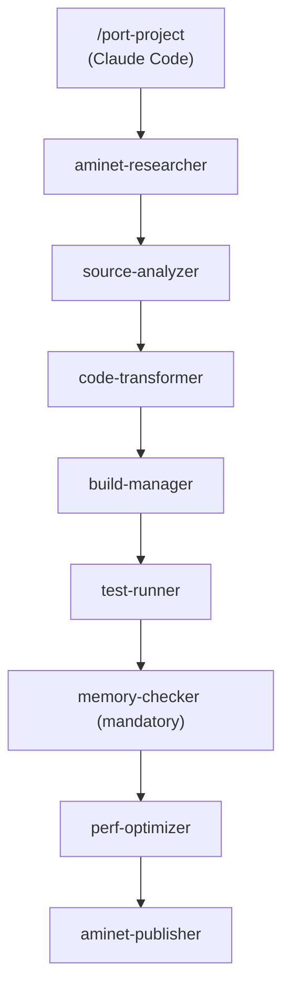

# amiport

A porting platform for bringing modern software to the classic Amiga.

amiport combines POSIX compatibility libraries, AI-powered build agents, and a complete AmigaOS developer knowledge base to port Linux/POSIX C programs to AmigaOS 3.x — from source analysis through to tested, Aminet-ready binaries.

[](https://github.com/bdgscotland/amiport/actions/workflows/ci.yml)
[](LICENSE)
[](https://aminet.net)

## Ports

| Port | Version | Category | Description | Status |
|------|---------|----------|-------------|--------|
| [cal](ports/cal/) | 1.32 | CLI | Unix calendar display (OpenBSD) | [Live on Aminet](https://aminet.net/package/util/cli/cal-1.0) |
| [cut](ports/cut/) | 1.28 | CLI | Extract fields/columns from text (OpenBSD) | [Live on Aminet](https://aminet.net/package/util/cli/cut-1.0) |
| [diff](ports/diff/) | 1.95 | CLI | File comparison utility (OpenBSD) | Known issues |
| [grep](ports/grep/) | 1.68 | CLI | Pattern search — regex, fixed, recursive (OpenBSD) | Built & tested |
| [sed](ports/sed/) | 1.47 | CLI | Stream editor — text transformation (OpenBSD) | Built & tested |
| [lua](ports/lua/) | 5.4.7 | Scripting | Lua 5.4 scripting language (PUC-Rio) | Built & tested |
| [tail](ports/tail/) | 1.24 | CLI | Display last part of a file with follow mode (OpenBSD) | Built & tested |

Pre-built Amiga binaries are included in each port directory. See **[PORTS.md](PORTS.md)** for the full catalog.

```bash
make build TARGET=ports/grep        # Build a specific port
make test TARGET=ports/grep         # Test in vamos emulator
make list-ports                     # Show all ports and status
make publish TARGET=ports/grep      # Package and upload to Aminet
```

## Quick Start

```bash
git clone https://github.com/bdgscotland/amiport.git
cd amiport
make setup              # REQUIRED — configures git hooks for pre-commit validation

# Check prerequisites and set up toolchain
make doctor             # Check what's installed
make setup-toolchain    # Pull cross-compiler Docker image

# Validate everything works
make smoke-test         # Full end-to-end: build shim -> build examples -> test in vamos

# Port a project (from within Claude Code)
/port-project /path/to/source.c
```

**Prerequisites:** Docker, Python 3, pip (`pip install amitools` for vamos)

## How It Works

### Compatibility Libraries

Most porting failures come from the POSIX gap — AmigaOS predates POSIX and provides none of its APIs natively. A typical Unix utility calls dozens of POSIX functions that simply do not exist on the Amiga. amiport bridges this with a three-tier compatibility model:

- **Tier 1 — posix-shim:** Direct POSIX-to-AmigaOS wrappers for ~50 functions where the semantics map cleanly (`open`, `read`, `stat`, `opendir`, `getopt`, etc.). Drop-in replacements with no caveats.
- **Tier 2 — posix-emu:** Approximate emulation for functions that have no direct Amiga equivalent but can be faked well enough for most use cases (`regex`, `pipe`, `select`, `mmap`). Each comes with documented limitations.
- **Tier 3 — Redesign required:** Functions that cannot be emulated and require architectural changes to the ported program (`fork`/`exec`, `pthreads`, X11/GTK/Qt). The pipeline flags these during analysis so you know up front.

| Library | Purpose | Link Flag |
|---------|---------|-----------|
| `lib/posix-shim/` | Tier 1: Direct POSIX-to-AmigaOS wrappers | `-lamiport` |
| `lib/posix-emu/` | Tier 2: Approximate POSIX emulation | `-lamiport-emu` |
| `lib/console-shim/` | Minimal ncurses API via console.device ANSI escapes | `-lamiport-console` |
| `lib/bsdsocket-shim/` | BSD socket API via bsdsocket.library | `-lamiport-net` |

See [docs/posix-tiers.md](docs/posix-tiers.md) for the complete function classification and [docs/architecture.md](docs/architecture.md) for the system design.

### AI Pipeline

The porting pipeline is 10 specialized AI agents, each with a defined role and constrained tools. Claude Code sits at the center, dispatching agents sequentially as each stage completes.



Safety hooks enforce discipline across the pipeline:

- Upstream source in `original/` directories is read-only — agents cannot edit it
- Direct compiler invocation is blocked — all builds go through `make` and the toolchain wrapper scripts
- The memory-checker agent runs on every port, mandatory, no exceptions — AmigaOS has no memory protection and no garbage collector, so every leaked allocation persists until reboot

| Agent | Role |
|-------|------|
| `aminet-researcher` | Check Aminet for existing ports before starting |
| `source-analyzer` | Deep portability analysis and tier classification |
| `code-transformer` | Systematic POSIX-to-Amiga source transformation |
| `build-manager` | Cross-compilation, error diagnosis, shim extension |
| `test-runner` | Emulator test execution and output validation |
| `port-coordinator` | Multi-file port orchestration and judgment calls |
| `memory-checker` | Memory leak detection, double-free, allocation safety |
| `perf-optimizer` | 68k instruction timing and loop optimization |
| `hardware-expert` | Amiga system architecture validation — CPU variants, address space, chipset capabilities |
| `debug-agent` | Autonomous Enforcer-based crash diagnosis and fix loop |
| `dependency-auditor` | External library dependency analysis |
| `aminet-publisher` | Aminet packaging, readme generation, upload |

Every architectural decision is recorded in ADRs and product decisions in PDRs — see [docs/adr/](docs/adr/) and [docs/pdr/](docs/pdr/).

The pipeline is currently driven by `/port-project`, which dispatches agents sequentially as a human-in-the-loop workflow. Full agent-to-agent orchestration is planned. Individual stages are also available directly as `/analyze-source`, `/transform-source`, `/build-amiga`, `/test-amiga`, `/review-amiga`, and `/debug-amiga`.

### Testing

Two automated testing paths cover different port categories, so every port gets validated without manual intervention.

**vamos** — fast, headless testing for CLI tools and scripting interpreters (Categories 1-2). A virtual AmigaOS runtime that runs in milliseconds with no emulator setup required.

```bash
make test TARGET=ports/grep         # Test a specific port
make smoke-test                     # Full end-to-end validation
```

**FS-UAE** — automated testing via ARexx harness for console UI and network apps (Categories 3-4). Test cases run unattended with TAP output and UAEQuit for automatic emulator shutdown. See [ADR-014](docs/adr/014-fs-uae-automated-testing.md) for the design.

```bash
make test-fsemu TARGET=ports/less   # Automated FS-UAE test with ARexx harness
```

**Interactive testing** — for manual exploration on a full Amiga desktop:

```bash
make setup-emu          # Install FS-UAE, check for Kickstart ROM
make install-emu        # Copy binaries to emulator directory
make emu                # Launch FS-UAE — ports mounted as WORK:
```

Requires [FS-UAE](https://fs-uae.net) and a Kickstart 3.1 ROM (~$10 from [amigaforever.com](https://www.amigaforever.com)).

### AmigaOS Knowledge Base

The project includes the complete Amiga Developer CD v2.1 — Commodore's official developer reference — converted to 3,600+ searchable markdown pages across five volumes:

- **Libraries** — Exec, DOS, Intuition, Graphics, and every other system library
- **Devices** — Console, Input, Timer, Audio, Serial, and more
- **Hardware** — Custom chips, DMA, copper lists, blitter
- **Amiga Mail** — Technical articles and programming guides
- **Autodocs** — Parsed API function signatures for 896 functions across 21 libraries

This is the reference material the AI agents reason with when making porting decisions — when the code-transformer needs to know how `dos.library/Lock()` works, or the build-manager needs to understand `exec/memory.h` structures, the answer is already in context.

The knowledge base is also independently useful as a modern, searchable version of the classic Commodore developer documentation.

Regenerate from source with `make scrape-adcd` (requires internet access, ~20 minutes).

## Make Targets

```bash
# Setup
make doctor                         # Check prerequisites
make setup-toolchain                # Pull cross-compiler Docker image
make fetch-ndk                      # Download AmigaOS NDK 3.2 R4

# Build & Test
make build-shim                     # Build POSIX shim library (Tier 1)
make build-emu                      # Build POSIX emulation library (Tier 2)
make build TARGET=ports/grep        # Build a specific port
make test TARGET=ports/grep         # Test via vamos
make smoke-test                     # Full end-to-end validation
make setup-debug-tools              # Install Enforcer, Mungwall, SegTracker
make check-docs                     # Validate doc consistency

# Emulator
make setup-emu                      # Install FS-UAE
make install-emu                    # Copy binaries to emulator
make emu                            # Launch FS-UAE
make test-fsemu TARGET=...          # Automated FS-UAE test
```

Run `make help` for the full list.

## Contributing

Four ways to help:

- **Port something new** — pick a Unix utility and run it through the pipeline. Check Aminet first (use the `aminet-researcher` agent) to avoid duplicating work that already exists in the archive.
- **Expand the POSIX shim** — add missing functions to `lib/posix-shim/` or `lib/posix-emu/`. The `/extend-shim` skill automates the full process: research, classify, implement, test.
- **Test on real hardware** — vamos and FS-UAE catch most issues, but nothing replaces a real A1200 or A4000. Hardware test reports for any port are valuable.
- **Improve the knowledge base** — better ADCD coverage, more cross-references, additional Autodoc parsing. See `docs/references/68k-hardware.md` for the 68k hardware reference used by the debug-agent.

See [CLAUDE.md](CLAUDE.md) for the full contributor guide, coding conventions, and architectural decisions.

## Acknowledgments

- [amigadev/m68k-amigaos-gcc](https://hub.docker.com/r/amigadev/m68k-amigaos-gcc) — pre-built cross-compiler
- [bebbo/amiga-gcc](https://github.com/bebbo/amiga-gcc) — m68k cross-compiler (upstream)
- [VBCC](http://sun.hasenbraten.de/vbcc/) — portable C compiler with Amiga targets
- [amitools/vamos](https://github.com/cnvogelg/amitools) — virtual AmigaOS runtime
- [FS-UAE](https://fs-uae.net) — Amiga emulator for interactive testing
- [Aminet](https://aminet.net) — The Amiga software archive
- [Amiga Developer CD v2.1](https://wiki.amigaos.net/wiki/Amiga_Developer_Docs) — Commodore/Amiga developer documentation (converted to markdown)

## License

MIT License. See [LICENSE](LICENSE).
