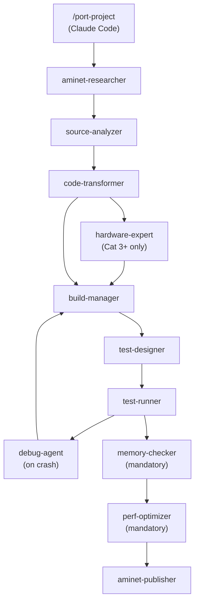

# amiport

A porting platform for bringing modern software to the classic Amiga.

amiport combines POSIX compatibility libraries, AI-powered build agents, and a complete AmigaOS developer knowledge base to port Linux/POSIX C programs to AmigaOS 3.x — from source analysis through to tested, Aminet-ready binaries.

[](https://github.com/bdgscotland/amiport/actions/workflows/ci.yml)
[](LICENSE)
[](https://aminet.net)
[](https://github.com/bdgscotland/amiport/stargazers)

> If you find this project useful or interesting, please give it a star! It helps others discover amiport and motivates continued development.

### End-to-end port of OpenBSD `tee` — 28 minutes, 20x speed


## Ports

| Port | Version | Category | Description | Status |
|------|---------|----------|-------------|--------|
| [cal](ports/cal/) | 1.32 | CLI | Unix calendar display (OpenBSD) | [Live on Aminet](https://aminet.net/package/util/cli/cal-1.0) |
| [cut](ports/cut/) | 1.28 | CLI | Extract fields/columns from text (OpenBSD) | [Live on Aminet](https://aminet.net/package/util/cli/cut-1.0) |
| [diff](ports/diff/) | 1.95 | CLI | File comparison utility (OpenBSD) | Submitted to Aminet |
| [grep](ports/grep/) | 1.68 | CLI | Pattern search — regex, fixed, recursive (OpenBSD) | [Live on Aminet](https://aminet.net/package/util/cli/grep-1.68) |
| [head](ports/head/) | 1.24 | CLI | Print first lines of files (OpenBSD) | [Live on Aminet](https://aminet.net/package/util/cli/head-1.24) |
| [lua](ports/lua/) | 5.4.7 | Scripting | Lua 5.4 scripting language (PUC-Rio) | Submitted to Aminet |
| [sed](ports/sed/) | 1.47 | CLI | Stream editor — text transformation (OpenBSD) | [Live on Aminet](https://aminet.net/package/util/cli/sed-1.47) |
| [sort](ports/sort/) | 1.0 | CLI | Sort lines of text files (Plan 9) | Built & tested |
| [tail](ports/tail/) | 1.24 | CLI | Display last part of a file with follow mode (OpenBSD) | Built & tested |
| [tee](ports/tee/) | 1.15 | CLI | Duplicate standard input (OpenBSD) | [Live on Aminet](https://aminet.net/package/util/cli/tee-1.15) |
| [wc](ports/wc/) | 1.32 | CLI | Count lines, words, and characters (OpenBSD) | Built & tested |
| [bc](ports/bc/) | 1.07.1 | CLI | Arbitrary precision calculator (GNU) | Built & tested |
| [jq](ports/jq/) | 1.7.1 | CLI | Lightweight command-line JSON processor (jqlang) | Built & tested |
| [less](ports/less/) | 692 | Console UI | Terminal pager with search and scroll (GNU) | Built & tested |
| [mg](ports/mg/) | 3.7 | Console UI | Micro Emacs-like text editor (troglobit/OpenBSD) | Built & tested |
| [comm](ports/comm/) | 1.11 | CLI | Compare two sorted files line by line (OpenBSD) | Built & tested |
| [rev](ports/rev/) | 1.16 | CLI | Reverse lines character by character (OpenBSD) | Built & tested |
| [expand](ports/expand/) | 1.15 | CLI | Convert tabs to spaces (OpenBSD) | Built & tested |
| [awk](ports/awk/) | 2024.12.25 | Scripting | Pattern scanning and processing (BWK) | Built & tested |
| [patch](ports/patch/) | 1.78 | CLI | Apply diff patches to source files (OpenBSD) | Built & tested |
| [uniq](ports/uniq/) | 1.33 | CLI | Filter/report repeated lines in files (OpenBSD) | Built & tested |
| [yes](ports/yes/) | 1.9 | CLI | Repeatedly output a string (OpenBSD) | [Live on Aminet](https://aminet.net/package/util/cli/yes-1.9) |

Pre-built Amiga binaries are included in each port directory. See **[PORTS.md](PORTS.md)** for the full catalog.

```bash
make build TARGET=ports/grep        # Build a specific port
make test TARGET=ports/grep         # Test in vamos emulator
make list-ports                     # Show all ports and status
make publish TARGET=ports/grep      # Package and upload to Aminet
```

## Quick Start

```bash
git clone https://github.com/bdgscotland/amiport.git
cd amiport
make setup              # REQUIRED — configures git hooks for pre-commit validation

# Check prerequisites and set up toolchain
make doctor             # Check what's installed
make setup-toolchain    # Pull cross-compiler Docker image

# Validate everything works
make smoke-test         # Full end-to-end: build shim -> build examples -> test in vamos

# Port a project (from within Claude Code)
/port-project /path/to/source.c
```

**Prerequisites:** Docker, Python 3, pip (`pip install amitools` for vamos)

## How It Works

### Compatibility Libraries

Most porting failures come from the POSIX gap — AmigaOS predates POSIX and provides none of its APIs natively. A typical Unix utility calls dozens of POSIX functions that simply do not exist on the Amiga. amiport bridges this with a three-tier compatibility model:

- **Tier 1 — posix-shim:** Direct POSIX-to-AmigaOS wrappers for ~90 functions where the semantics map cleanly (`open`, `read`, `stat`, `opendir`, `getopt`, `glob`, `fnmatch`, `scandir`, etc.). Drop-in replacements with no caveats.
- **Tier 2 — posix-emu:** Approximate emulation for functions that have no direct Amiga equivalent but can be faked well enough for most use cases (`regex`, `pipe`, `select`, `mmap`). Each comes with documented limitations.
- **Tier 3 — Redesign required:** Functions that cannot be emulated and require architectural changes to the ported program (`fork`/`exec`, `pthreads`, X11/GTK/Qt). The pipeline flags these during analysis so you know up front.

| Library | Purpose | Link Flag |
|---------|---------|-----------|
| `lib/posix-shim/` | Tier 1: Direct POSIX-to-AmigaOS wrappers | `-lamiport` |
| `lib/posix-emu/` | Tier 2: Approximate POSIX emulation | `-lamiport-emu` |
| `lib/console-shim/` | Minimal ncurses API via console.device ANSI escapes | `-lamiport-console` |
| `lib/bsdsocket-shim/` | BSD socket API via bsdsocket.library | `-lamiport-net` |
| `lib/posix-shim/include/amiport/compat.h` | Platform compatibility: 68k alignment macros, compiler workarounds | `#include <amiport/compat.h>` |

See [docs/posix-tiers.md](docs/posix-tiers.md) for the complete function classification and [docs/architecture.md](docs/architecture.md) for the system design.

### AI Pipeline

The porting pipeline is 16 specialized AI agents, each with a defined role and constrained tools. Claude Code sits at the center, dispatching agents sequentially as each stage completes.



Safety hooks enforce discipline across the pipeline:

- Upstream source in `original/` directories is read-only — agents cannot edit it
- Direct compiler invocation is blocked — all builds go through `make` and the toolchain wrapper scripts
- The memory-checker agent runs on every port, mandatory, no exceptions — AmigaOS has no memory protection and no garbage collector, so every leaked allocation persists until reboot

| Agent | Role |
|-------|------|
| `aminet-researcher` | Check Aminet for existing ports before starting |
| `source-analyzer` | Deep portability analysis and tier classification |
| `code-transformer` | Systematic POSIX-to-Amiga source transformation |
| `build-manager` | Cross-compilation, error diagnosis, shim extension |
| `test-runner` | Emulator test execution and output validation |
| `port-coordinator` | **Deprecated** — cannot dispatch subagents; orchestrate from main session |
| `memory-checker` | Memory leak detection, double-free, allocation safety |
| `perf-optimizer` | 68k instruction timing and loop optimization (static analysis) |
| `profiler` | ReadEClock-based runtime measurement — validates perf-optimizer findings |
| `hardware-expert` | Amiga system architecture validation — CPU variants, address space, chipset capabilities |
| `debug-agent` | Autonomous Enforcer-based crash diagnosis and fix loop |
| `dependency-auditor` | External library dependency analysis |
| `test-designer` | Comprehensive FS-UAE test suite generation from source analysis |
| `aminet-publisher` | Aminet packaging, readme generation, upload |
| `site-manager` | Website deployment, manifest generation, security scanning, testing |
| `visual-test-expert` | Visual test authoring and debugging — SCRAPE/SCREEN_READ/EXPECT_TRAP_CURSOR (ADR-024/025) |
| `amiport-publisher` | Test-gated publishing to amiport.platesteel.net — validates tests before allowing downloads |

Every architectural decision is recorded in ADRs and product decisions in PDRs — see [docs/adr/](docs/adr/) and [docs/pdr/](docs/pdr/).

The pipeline is driven by `/port-project`, which dispatches agents sequentially with human-in-the-loop approval at Tier 2/3 decision points. Individual stages are also available directly as `/analyze-source`, `/transform-source`, `/build-amiga`, `/test-amiga`, `/review-amiga`, and `/debug-amiga`.

**Context-loading skills** (invoked on demand to load reference documentation):
| Skill | Loads |
|-------|-------|
| `/amiga-api-lookup` | ADCD 2.1 reference library — function signatures, struct layouts, code examples for exec/dos/timer/intuition/graphics |
| `/c89-reference` | C89/ANSI C constraints — GCC 6.5.0b extensions, libnix runtime behavior, what C99+ features are NOT available |
| `/write-arexx` | ARexx language reference, FS-UAE test harness patterns, known gotchas |
| `/extend-shim` | Add a missing POSIX function to the shim library — research, classify, implement, test |
| `/review-amiga` | Amiga-specific code review — stack safety, BPTR handling, memory patterns, logic bugs |
| `/debug-amiga` | Debug crashed ports — Enforcer hit capture, autonomous fix loop |

### Testing

Two automated testing paths cover different port categories, so every port gets validated without manual intervention.

**vamos** — fast, headless smoke testing for quick iteration. A virtual AmigaOS runtime that runs in milliseconds with no emulator setup required.

```bash
make test TARGET=ports/grep         # Quick smoke test via vamos
make smoke-test                     # Full end-to-end validation
```

**FS-UAE** — mandatory for every port. Automated testing via ARexx harness inside real AmigaOS 3.1, with TAP output and UAEQuit for automatic emulator shutdown. vamos doesn't simulate real AmigaOS behavior — programs that pass on vamos can crash on real hardware. See [ADR-014](docs/adr/014-fs-uae-automated-testing.md) for the design.

```bash
make test-fsemu TARGET=ports/grep   # Automated FS-UAE test with ARexx harness
```

**Interactive testing** — automated keystroke injection for Category 3+ console programs using KeyInject (`toolchain/keyinject/`), which injects keystrokes via `commodities.library/AddIEvents()`. Add `ITEST:` blocks to `test-fsemu-cases.txt`. See [ADR-023](docs/adr/023-automated-interactive-testing.md).

**Visual verification** — character-level screen assertions using a forked FS-UAE with ANSI console capture. Add `SCRAPE`, `EXPECT_AT row,col,text`, and `EXPECT_CURSOR row,col` to ITEST blocks. Requires `~/Developer/fs-uae/` (forked FS-UAE with console capture). See [ADR-024](docs/adr/024-visual-verification.md).

**Cursor position verification** — trap-based ConUnit reading via ScreenRead (`toolchain/screenread/`). Add `SCREEN_READ` and `EXPECT_TRAP_CURSOR row,col` to visual test blocks (COOKED mode only). For RAW mode programs, use `EXPECT_AT` on the program's status line. Visual tests use host-side key injection (`scripts/inject-keys.sh` via macOS osascript) instead of Amiga-side KeyInject. See [ADR-025](docs/adr/025-screen-read-trap.md).

**Manual testing** — for manual exploration on a full Amiga desktop:

```bash
make setup-emu          # Install FS-UAE, check for Kickstart ROM
make install-emu        # Copy binaries to emulator directory
make emu                # Launch FS-UAE — ports mounted as WORK:
```

Requires [FS-UAE](https://fs-uae.net) and a Kickstart 3.1 ROM (~$10 from [amigaforever.com](https://www.amigaforever.com)).

**How FS-UAE testing works:**

```
make test-fsemu TARGET=ports/cal
        |
        v
FS-UAE boots AmigaOS 3.1 (Kickstart 3.1 ROM + Workbench HDF)
        |
        v
User-Startup launches ARexx: RexxMast -> rx test-runner.rexx
        |
        v
ARexx harness: parse test cases -> execute commands -> capture output -> compare expected -> TAP results
        |
        v
UAEQuit shuts down emulator -> host reads TAP from shared volume -> TEST-REPORT.md generated
```

**Test results from real ports:**

- **cal** — 22/22 tests passing
- **cut** — 20/20 tests passing
- **grep** — 22/22 tests passing (regex, fixed string, recursive, error paths)
- **sed** — 15/15 tests passing
- **head** — 15/15 tests passing
- **tee** — 15/15 tests passing

Test suites are AI-generated — the `test-designer` agent analyzes ported source code (control flow, error paths, boundary conditions) and generates comprehensive test cases automatically. When tests hang, the harness diagnoses the failure mode rather than just reporting "timeout."

### AmigaOS Knowledge Base

The project includes the complete Amiga Developer CD v2.1 — Commodore's official developer reference — converted to 3,600+ searchable markdown pages across five volumes:

- **Libraries** — Exec, DOS, Intuition, Graphics, and every other system library
- **Devices** — Console, Input, Timer, Audio, Serial, and more
- **Hardware** — Custom chips, DMA, copper lists, blitter
- **Amiga Mail** — Technical articles and programming guides
- **Autodocs** — Parsed API function signatures for 896 functions across 21 libraries

This is the reference material the AI agents reason with when making porting decisions — when the code-transformer needs to know how `dos.library/Lock()` works, or the build-manager needs to understand `exec/memory.h` structures, the answer is already in context.

The knowledge base is also independently useful as a modern, searchable version of the classic Commodore developer documentation.

Regenerate from source with `make scrape-adcd` (requires internet access, ~20 minutes).

The project also includes **Amiga Intern** (1992, Abacus) — a 992-page hardware reference converted from [Internet Archive OCR](https://archive.org/details/Amiga_Intern_1992_Abacus) to 42 markdown chapters. This complements the ADCD with deep hardware internals that the `hardware-expert` and `perf-optimizer` agents use:

- **68030 CPU** — instruction pipeline, PMMU, FPU, cache behavior (95KB)
- **Custom chips** — Agnus, Denise, Paula internal structure and pin descriptions
- **Memory map** — Complete address space layout and all 227 chip register addresses
- **Hardware programming** — DMA slots, bus timing, Copper, Blitter algorithms, interrupts

Regenerate with `python3 scripts/convert-amiga-intern.py`.

## Website

The project website at [amiport.platesteel.net](https://amiport.platesteel.net) serves as both a package index and a showcase of the porting pipeline. It uses an Amiga MUI (Magic User Interface) design system — warm gray base, amber/brown/red Commodore accents, 1px bevels, no blue, no rounded corners. See [DESIGN.md](DESIGN.md) for the full spec.

| Page | Purpose |
|------|---------|
| `index.html` | Landing page — hero terminal animation, featured packages, getting started guide, port request form |
| `packages.html` | Package browser — search, filter, sort, rich detail view with porting notes, test gauges, and known limitations |
| `stats.html` | Stats dashboard — SVG bar charts for downloads, category breakdown, publication timeline |
| `amiga.html` | Dedicated page for classic Amiga browsers (IBrowse, AWeb, NetSurf). HTML 3.2, table layout, <30KB, 640x480 |
| `feed.php` | RSS 2.0 feed of published packages |

The site uses no CSS frameworks, no JS charting libraries, no CDN dependencies, and no web fonts. Keyboard shortcuts are available on the packages page: <kbd>P</kbd> packages, <kbd>S</kbd> stats, <kbd>/</kbd> search, <kbd>Esc</kbd> close.

Each package JSON in `site/data/packages/` includes enriched fields (`porting_notes`, `test_count`, `test_pass`, `known_limitations`) that power the rich detail view — showing what was technically interesting about each port, not just metadata.

## Make Targets

```bash
# Setup
make setup                          # Configure git hooks (run after cloning)
make doctor                         # Check prerequisites
make setup-toolchain                # Pull cross-compiler Docker image
make fetch-ndk                      # Download AmigaOS NDK 3.2 R4
make setup-debug-tools              # Install Enforcer, Mungwall, SegTracker

# Build
make build-shim                     # Build POSIX shim library (Tier 1)
make build-emu                      # Build POSIX emulation library (Tier 2)
make build-console                  # Build console shim (ncurses)
make build-net                      # Build BSD socket shim
make build-keyinject                # Build KeyInject (keystroke injector, ADR-023)
make build TARGET=ports/grep        # Build a specific port
make build-ports                    # Build all ports

# Test
make test TARGET=ports/grep         # Test via vamos
make test-shim                      # Run shim library tests
make test-ports                     # Test all ports via vamos
make test-fsemu TARGET=...          # Automated FS-UAE test
make smoke-test                     # Full end-to-end validation

# Validation
make check-docs                     # Validate doc consistency
make check-agents                   # Validate agent/skill frontmatter
make check-test-coverage            # Validate FS-UAE test suite completeness
make check-fix-propagation          # Scan ports for known crash patterns
make check-port-metadata            # Validate port metadata consistency
make check-arexx                    # Validate ARexx syntax (non-ASCII, compounds)
make check-aminet                   # Check Aminet publication status

# Emulator
make setup-emu                      # Install FS-UAE
make install-emu                    # Copy binaries to emulator
make emu                            # Launch FS-UAE

# Publish
make publish TARGET=ports/grep      # Package and upload to Aminet
```

Run `make help` for the full list.

## Contributing

Four ways to help:

- **Port something new** — pick a Unix utility and run it through the pipeline. Check Aminet first (use the `aminet-researcher` agent) to avoid duplicating work that already exists in the archive.
- **Expand the POSIX shim** — add missing functions to `lib/posix-shim/` or `lib/posix-emu/`. The `/extend-shim` skill automates the full process: research, classify, implement, test.
- **Test on real hardware** — vamos and FS-UAE catch most issues, but nothing replaces a real A1200 or A4000. Hardware test reports for any port are valuable.
- **Improve the knowledge base** — better ADCD coverage, more cross-references, additional Autodoc parsing. See `docs/references/68k-hardware.md` for the 68k hardware reference used by the debug-agent.

See [CLAUDE.md](CLAUDE.md) for the full contributor guide, coding conventions, and architectural decisions.

## Acknowledgments

- [amigadev/m68k-amigaos-gcc](https://hub.docker.com/r/amigadev/m68k-amigaos-gcc) — pre-built cross-compiler
- [bebbo/amiga-gcc](https://codeberg.org/bebbo/amiga-gcc) — m68k cross-compiler (upstream, GCC 6.5.0b)
- [VBCC](http://sun.hasenbraten.de/vbcc/) — portable C compiler with Amiga targets
- [amitools/vamos](https://github.com/cnvogelg/amitools) — virtual AmigaOS runtime
- [FS-UAE](https://fs-uae.net) — Amiga emulator for interactive testing
- [Aminet](https://aminet.net) — The Amiga software archive
- [Amiga Developer CD v2.1](https://wiki.amigaos.net/wiki/Amiga_Developer_Docs) — Commodore/Amiga developer documentation (converted to markdown)

## License

MIT License. See [LICENSE](LICENSE).
